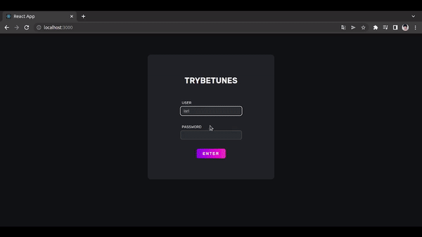
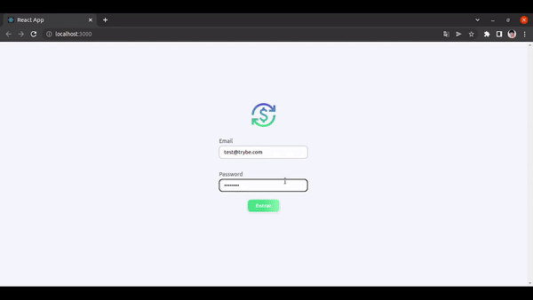

  

# Larissa Araújo

Hey I'm Larissa, I am in a career transition for Fullstack Web Development. Since then I have developed projects using Git, Javascript, Jest, React JS, Sass, Docker and MySql. I also enjoy ux and design in general.

## Resume

  

## Contact

## Skills

                              

## Examples of Work

   <a href="https://github.com/larissajuliavsa/trybetunes">  
Trybetunes
</a>
  <a href="https://github.com/larissajuliavsa/trybewallet">        
Trybewallet
</a>

## Stats

